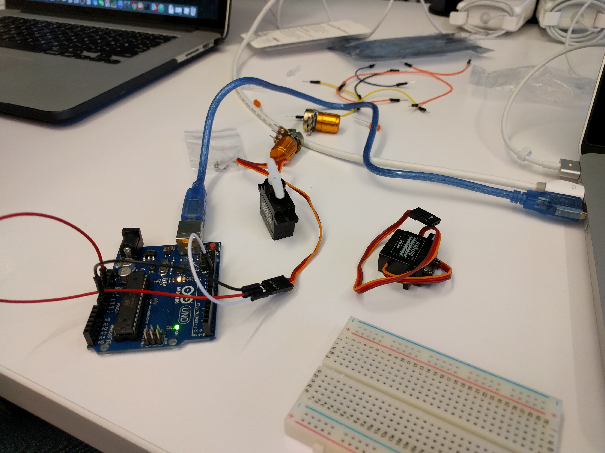
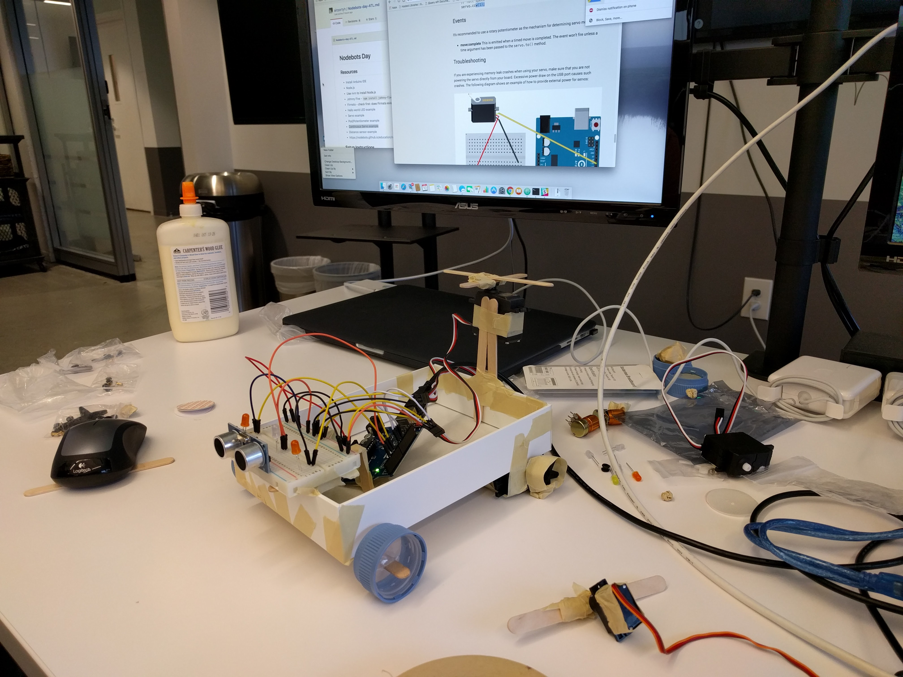

# nodebotsDay
ATLjs meetup presents: "Nodebots Day" 2016

> Always knew my childhood dreams would be reached thanks to tape, glue, cardboard, robotics, and imagination

#Hardware

* Arduino Uno
* LED lights
* Flexible Breadboard Jumper Wires
* Proximity Sensors
* Servo Motors
* Breadboard
* Popsicle sticks, glue, tape, cardboard box

